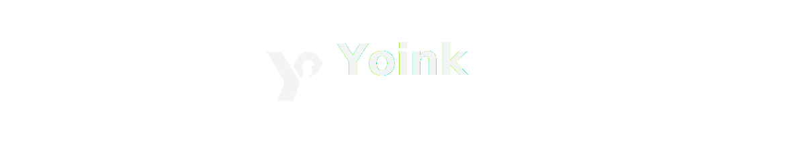
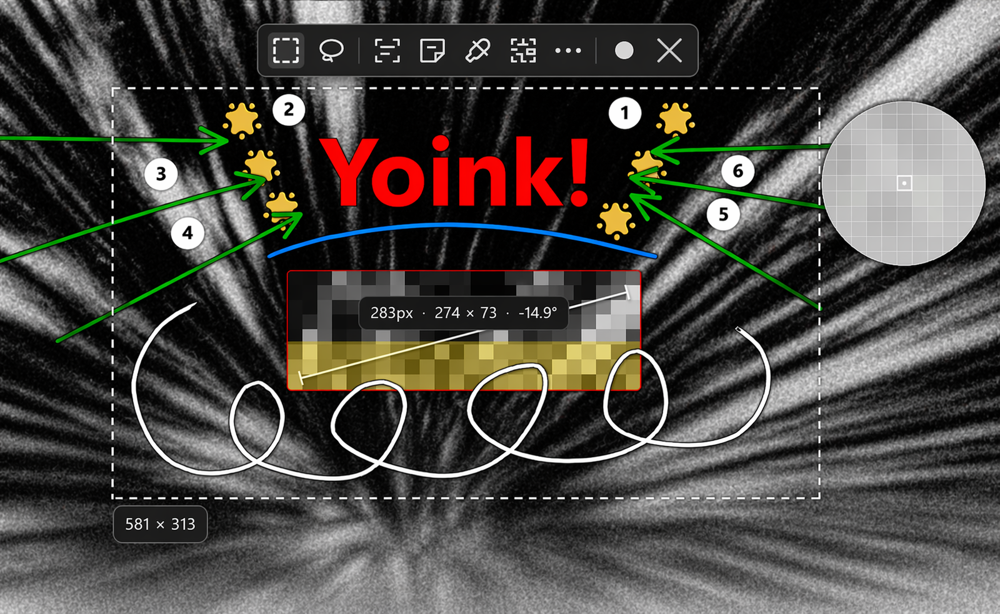
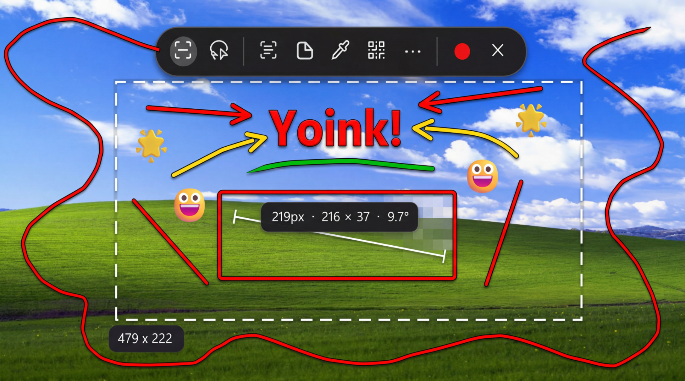
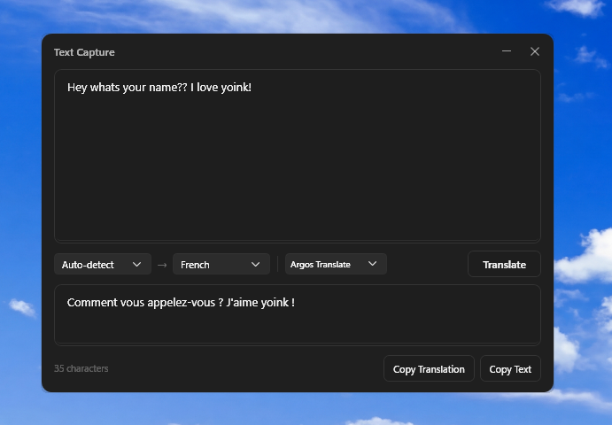
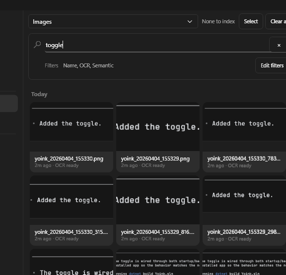

<p align="center">
  
</p>

<p align="center">
  <strong>yoink
</p>

<p align="center">
  Capture, annotate, OCR, translate, make stickers, record video, save locally, search images with OCR, and many more features.
</p>

<p align="center">
  <a href="https://github.com/jasperdevs/yoink/releases/latest">
    
  </a>
  <a href="https://github.com/jasperdevs/yoink/releases">
    
  </a>
  <a href="https://github.com/jasperdevs/yoink/releases/latest">
    
  </a>
  <a href="https://github.com/jasperdevs/yoink/stargazers">
  
</a>
  <a href="https://github.com/jasperdevs/yoink/blob/main/LICENSE">
    
  </a>
</p>


<p align="center">
  <a href="https://github.com/jasperdevs/yoink/releases/latest">
    
  </a>
  
  
</p>

<p align="center">

</p>

## Download

Grab the latest release from the [**Releases page**](https://github.com/jasperdevs/yoink/releases/latest).

## Winget

```powershell
winget install --id JasperDevs.Yoink -e
winget upgrade --id JasperDevs.Yoink -e
```

## Features

<table>
<tr>
<td width="40%" valign="middle">
<h3>Capture modes</h3>
Region, fullscreen, active-window, and scrolling capture in one ShareX-style workflow.
</td>
<td width="60%">

</td>
</tr>
<tr>
<td width="40%" valign="middle">
<h3>AI Redirects</h3>
Open ChatGPT, Claude, Gemini, or Google Lens right after capture with the image ready to drag, paste, or inspect.
</td>
<td width="60%">

</td>
</tr>
<tr>
<td width="40%" valign="middle">
<h3>Sticker creation</h3>
Remove backgrounds and turn screenshots into polished stickers with optional stroke and shadow finishing.
</td>
<td width="60%">

</td>
</tr>
<tr>
<td width="40%" valign="middle">
<h3>OCR + translation</h3>
Extract text from any screen region, edit the result, and translate it with local or cloud-backed providers.
</td>
<td width="60%">

</td>
</tr>
<tr>
<td width="40%" valign="middle">
<h3>Recording</h3>
Record GIFs and videos in multiple formats with optional microphone and desktop audio capture.
</td>
<td width="60%">

</td>
</tr>
<tr>
<td width="40%" valign="middle">
<h3>Searchable history</h3>
Find past captures by filename, OCR text, or semantic similarity so you can recover screenshots by meaning, not just date.
</td>
<td width="60%">

</td>
</tr>
</table>

- **Built-in annotation** - Arrows, text, shapes, blur, freehand markup, and polished stroke/shadow effects
- **100+ OCR languages** - Download language packs on demand for multilingual text extraction
- **Utility tools** - Color picker, QR/barcode scanner, ruler, and step numbering built into the capture flow
- **Flexible uploads** - Send screenshots, stickers, and recordings to 15+ services including Imgur, S3, Dropbox, and self-hosted targets

## AI Redirects

Yoink can open a new chat or Lens page in your browser after capture, then keep the image ready to drag in or paste.

<p align="left">
  
</p>

- Open `ChatGPT`, `Claude`, `Claude Opus`, `Gemini`, or `Google Lens`
- Keep the captured image on screen as a toast for drag and drop or `Ctrl+V`
- Optional dedicated hotkey for redirect-only capture
- Google Lens support with hosted image links when needed

## Stickers

Yoink can turn captures into stickers by removing the background, then saving, previewing, copying, and uploading them like normal images.

<p align="left">
  
</p>

- Cloud sticker providers: `remove.bg`, `Photoroom`
- Local sticker models: `U2Netp`, `BRIA RMBG`
- Optional sticker finishing: drop shadow and white stroke

## OCR & Translate

Yoink can extract text from any region of your screen and translate it instantly. OCR results open in a dedicated window where you can edit, copy, or translate the text.

<p align="left">
  
</p>

- Extract text from screenshots with Tesseract OCR
- Auto-download language packs for 100+ languages
- Translate with the open-source local translator, Google Translate API, or manually installed Argos Translate
- Dedicated result window with copy and translate buttons

## Recording

Yoink can record screen clips as GIFs or videos without leaving the app.
<p align="left">
  
</p>

- Record `GIF`, `MP4`, `WebM`, or `MKV`
- Optional microphone and desktop audio capture
- Fullscreen or region-based recording flow
- Upload recorded output with the same destinations as screenshots

## Search

Search your image history by filename, OCR text, and semantic matching, so you can find screenshots by what they say or by what they show.


<p align="left">
  
</p>


- Search by text inside the image with OCR
- Search by semantic similarity to find visually related screenshots

## Uploads

Yoink can upload screenshots, stickers, and recordings after capture. Upload targets include:

- Public hosts like `Imgur`, `ImgBB`, `Catbox`, `Litterbox`, `Gyazo`, `file.io`, and `Uguu`
- Rotating temporary-host mode that falls through free temporary hosts automatically
- Cloud targets like `Dropbox`, `Google Drive`, `OneDrive`, `Azure Blob`, and `S3-compatible storage`
- Self-hosted and developer targets like `GitHub`, `Immich`, `FTP`, `SFTP`, `WebDAV`, and `Custom HTTP`

Availability depends on the target service and your credentials.

Sticker uploads use the same upload destinations as normal image uploads.

## Star History

<a href="https://www.star-history.com/#jasperdevs/yoink&Date">
  
</a>
